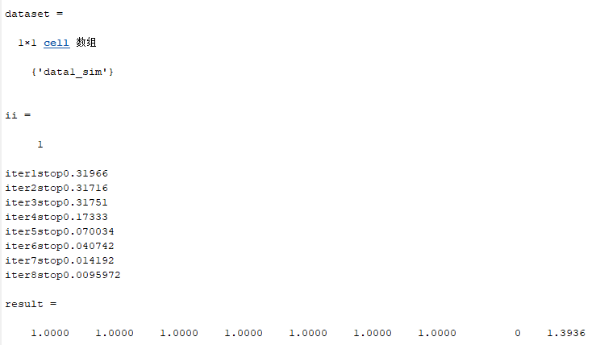
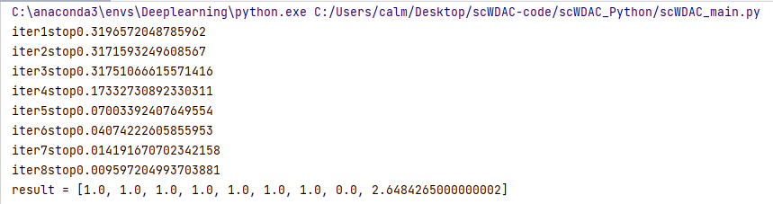

# scWDAC

This repository provides the scWDAC method for clustering single-cell multi-omics data. You can use this tool in both **MATLAB** and **Python**.
For any questions, please do not hesitate to contact me at wzhang_math@whu.edu.cn.

## Overview
The scWDAC method is designed for clustering single-cell multi-omics data. It integrates multiple data views by employing a weighted distance penalty and adaptive consistent graph regularization to improve clustering performance.

---

## Implementation Options

### Directory Structure
* `datasets/`: This folder contains the input data files (e.g., `.mat` files). Each dataset consists of multi-omic data (`X`), where the dimension of each omic `X{v}` is $n \times m$ (number of cells $\times$ number of features), along with the true labels (`true_label`), which has dimensions of $n \times 1$.
* `functions/`: This directory stores the essential sub-functions and algorithm logic required for the scWDAC method.

### Output and Evaluations
Once the execution is complete, the program will output a result vector. This vector contains the following performance metrics in order:
| Index | Metric | Description |
| :--- | :--- | :--- |
| 1 | **ACC** | Accuracy  |
| 2 | **NMI** | Normalized Mutual Information |
| 3 | **F-score** | F1 Score |
| 4 | **Precision** | Precision |
| 5 | **ARI** | Adjusted Rand Index |
| 6 | **Purity** | Purity |
| 7 | **Recall** | Recall |
| 8 | **Entropy** | Entropy |
| 9 | **Time** | Time (seconds) |

### Option 1: MATLAB (Recommended for MATLAB Users)
Use the native MATLAB implementation for optimal performance.

#### **Requirements**
* **MATLAB version**: R2020a or later.

#### **Quick Start**
* Add the project folder to your **MATLAB** path.
* Run the main script:
   ```matlab
   scWDAC_main

<p align="left">
  
</p>

### Option 2: Python (Recommended for Python Users)

#### **Requirements**
* **Python version**: 3.8+ (recommended).
* **Core dependency**: numpy >= 1.26.4.

#### Quick Start
* Open the project in **PyCharm**.
* Locate and open the script **` scWDAC_main.py `**.
* Run the script:
  ```python
   scWDAC_main.py 
  
<p align="left">
  
</p>
